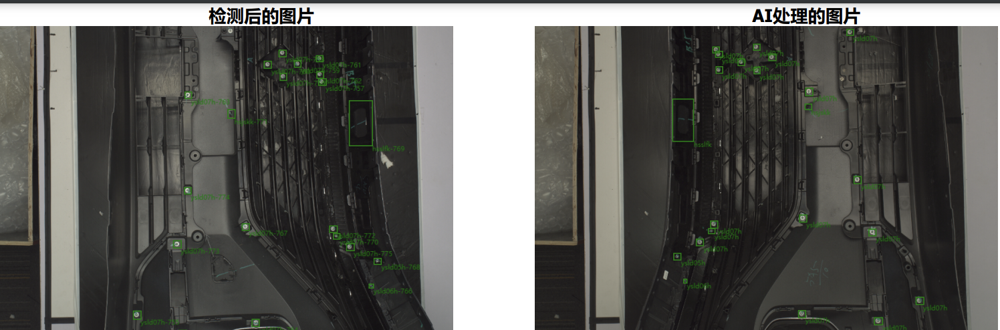

### 标准件嵌件点与测试件嵌件点匹配算法
#### 背景：
场景：汽车零部件装配车间
采用目标检测和分类，对各种零部件（此处各嵌件）后，再经过双目定位，转换到同一坐标系下，此时标准件和测试件的配准工作尤为重要用来确定标准件和测试件之间一对一的关系。
此算法可以在出现：
1. 多检测
2. 少检测
3. 检测错误
4. 平移旋转
等情况下适用

#### 原理  
输入：  
	数据库中的标准件信息列表：P=[p_1,p_2,…,p_n]   
	样本件通过模型检测出的坐标以及置信度列表Q=[q_1,q_2,…,q_m]  
输出：  
	标准件和测试件中嵌件的一一对应关系  
步骤：  
Step1. 通过标准件信息初始化  
1）计算各个嵌件点之间的相互距离D_{P:n×n}   
2）计算各个嵌件点之间的相互角度A_{P:n×n×n} （嵌件点个数>=3）  
3）生成各个嵌件点的特征向量（top 3 近的点）（嵌件点个数>=3）  

Step2. 输入测试件中嵌件点的信息（初始化测试件信息）  
1）计算各个嵌件点之间的相互距离D_{P:n×n}   
2）计算各个嵌件点之间的相互角度A_{P:n×n×n} （嵌件点个数>=3）  
3）生成各个嵌件点的特征向量（top 3 近的点）（嵌件点个数>=3）  
Step3. 情况细分  
Case 1：  
    检测工件中嵌件数量为1  
	按照高度进行匹配  
	按照类别进行匹配  
Case2：  
    检测工件中嵌件数量为2  
	按照置信度排序  
	按高度进行匹配  
	按嵌件相互距离进行匹配  
	按照类别进行匹配  
Case3：  
    检测工件中嵌件数量>=3  
第一次匹配：  
	按照置信度排序  
	按照高度进行匹配  
	按照相互距离进行匹配  
	按照角度进行匹配  
	按照类别进行匹配  
第二次匹配：  
	按照相互距离进行匹配（top3最近的嵌件）特征向量匹配  
	角度进行匹配  
	按照类别进行匹配  

Step4. case1，2直接返回匹配结果，case3通过Ransac计算仿射变换矩阵M  

Step5. 把测试工件上的嵌件点坐标全部经过M转换到标准工件所在的坐标系  
	更新已匹配的字典（删除错误的匹配，通过Ransac的输出mask）  
	对转换后的测试工件寻找最近的未匹配的标准件上的嵌件点，符合条件就加入已匹配字典  
	
To Do List  
	尝试放宽条件（增加一些可能匹配关系），可是适当增加算法的鲁棒性  
	少用循环，多使用向量，矩阵运算  
	存在特殊情况，需要调整匹配顺序能获得唯一准确匹配  
	对称会对计算矩阵M有影响，制定策略  
	
### 样例截图（已经实际运用）：

